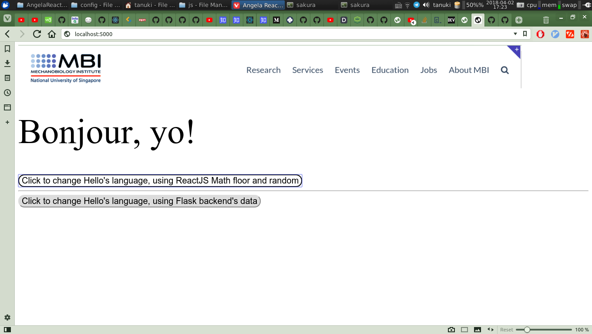

Follow along this Youtube Talk :shipit: :shipit: 

EVENT: EuroPython Conference, July 2017

SPEAKER: Angela Juvet Branæs

Title: Creating A Full Stack Web App with Python, NPM, Webpack, and React

Youtube [link](https://www.youtube.com/watch?v=7JnWfDczo-8)

Blog Article [link](https://codeburst.io/creating-a-full-stack-web-application-with-python-npm-webpack-and-react-beauty-and-495bfdf11841)



The Structure of this web app:
index.html, style.css, bundle.js, index.jsx, App.js, ButtonReactHello.js, ButtonFlaskHello.js, jQeury = Front End

Python Flask, Python = Back End

index.html is for the index of the whole structure, and historically this is the ENTIRE skeleton of the website

In **React**, all the content of the front end are now in React now, instead of the index.html
And we will be loading in the compressed js files into the html file. 

the style.css and bundle.js are both bundled by a third-party tool, **Webpack**

## Webpack

**Webpack** is a **module bundler**. It takes all your module dependencies and generates static assets that represent them. Using a module bundler reduces the amount of modules your browser need to load, thereby decreasing the loading time of your webpages significantly for larger projects.

Module bundler minimises the number of script tags in the HTML, and leads to faster loading and less hassle (scripts are global and takes time to load etc)

With Webpack, it bundles the dependencies. It gives an entry point, and creates a dependency-tree. And you attach this bundled js file to the HTML, no need to worry about the global variable and order of the script tags

it is also using lazy module loading

so webpack basically turns all your modules with dependencies to static assets like .jpg, .png, .js and .css

**ONE THING TO NOTE ABOUT WEBPACK**:
it only understnads JavaScript!
So everything else needs a loader or plugin

JS, CSS, files, images, background etc, all need loader

in Webpack, everything is a module. You can `require()` everything in the javascript

Install Webpack:
```
$ npm i webpack --save-dev
```
To use webpack, we need to add a **Webpack config file**. The config tells webpack where to find the Javascript and React files, and where to put the generated Javascript bundle.

Add a file named webpack.config.js in your static folder.

React files are index.jsx, App.js, and ButtonReactHello.js+ButtonFlaskHello.js, and are passed in the Babel to convert to normal JS, and webpack takes the JS from Babel and make it to something the browser can understand

## NPM Run

Adding a few **run** commands to the package.json file makes the development process more fluid. 

*Build* is used for production builds
```
"scripts": {
  "build": "webpack --progress -p --config webpack.config.js",
},
```
*dev-build* for non-minified builds
```
"scripts": {
  "dev-build": "webpack --progress -d --config webpack.config.js",
},
```
**Watch** is similar to **dev-build**, with the added benefit that it monitors your project files. Any changed files will be automatically rebuilt, and refreshing your browser will show the change you just made.
```
"scripts": {
  "watch": "webpack --progress -d --config webpack.config.js --watch"
},
```

## Babel

Babel allows us to write next generation Javascript before it becomes the browser standard. By installing the **es2015 and react presets**, Babel converts our Javascript and React jsx files into Javascript syntax compatible with all modern browsers.

Babel basically turns modern, new, advanced next-gen javascript into browser-compatible JS out:
```javascript
[1,2,3].map(n => n **2);
[1,2,3].map(function (n) {
  return Math.pow(n,2);
});
```

**Note:** In order to convert the `changelang = () => {...}` in Babel, you need the right Babel extensions, especially `stage-2` :
```
  "babel": {
    "presets": [
      "env",
      "stage-2",
      "react"
    ]
  }
```
`presets` basically means what type of javascript do you want me to understand and convert between. So this means we ask the babel to detect `es2015` and `react` syntax and convert them to normal JS. 

next add a babel-loader rule to the webpack config:
that set the rule for how webpack configure the files, and **it is important to exclude: /node_modules/**, as it also contains a lot of js files, and it is going to spend a lot of time configuring the js using babel-loader

## Python Flask

In the server directory, create the Flask server file. Add a “/hello” endpoint which will return “Hello World!” and an index endpoint “/“ that will render the index.html template.

Set up a simple python route for root, and go to localhost 5000
```
127.0.0.1 - - [31/Mar/2018 21:42:45] "GET / HTTP/1.1" 200 -
127.0.0.1 - - [31/Mar/2018 21:42:45] "GET /dist/bundle.js HTTP/1.1" 200 -
```

Changed /hello to return return a random choice from the list:
```
@app.route('/hello')
def hello():
    greeting_list = ['Ciao', 'Hei', 'Salut', 'Hola', 'Hallo', 'Hej', 'Hello']
    return random.choice(greeting_list)
```

## Points on React

React has something called components and props. Props are immutable parameters passed to the constructor at creation time. Props are public, and changing them would violate one of the fundamental principles of react. State is internal, and mutable. Whenever you update state, it gets re-rendered in the UI.

**Binding “this”**
Because class methods in JavaScript aren’t bound by default, we have to create a binding in our constructor when we want to use “this” in a function callback. Otherwise our “this” function will be undefined. This applies whenever you call a function without () in JavaScript. An example of doing this, is the “onClick={this.getPythonHello}” in our render().

What is JSX?
It is syntax extension to JavaScript.
It is optimised on compilation, so faster than JavaScript.
**JSX is statically typed and mostly type-safe, while JS is not**.

```javascript
<Hello name="Tom" />
React.createElement(Hello, {name: "Tom"}, null)
```


## Requesting Information From The Server

React does not come with a built-in way of performing HTTP requests. To achieve our goal of requesting information from the server, we will have to pick a library that can do this for us. One of the easiest ways of doing this, is to include the jQuery library. jQuery is a javascript library that simplifies standard javascript functions by providing abbreviated functions behind $ notation.

Start by installing the jQuery dependency:

```
$ npm i jquery --save-dev
```
Add a jQuery requirement to the react file where it is going to be used
```
// use jquery to perform a GET request against the server
let $ = require('jquery');
```
Adding the query requirement to our react file means we can use standard jQuery functions in our react code, as long as they start with the “$” variable we just defined. 

We will be using a **GET HTTP request** to fetch information. **GET** is essentially the “Read Only” mode for HTTP requests. You can fetch information, but you can’t ask the server to alter it.

```javascript
  getFlaskHello = () => {
    $.get(window.location.href + 'hello', (data) => {
      console.log(data);
      this.props.handleGET(data);
    });
  }
```
`jQuery.get( url [, data ] [, success ] [, dataType ] )` Returns: `jqXHR`
Description: Load data from the server using a HTTP GET request.
This is a shorthand Ajax function, which is equivalent to:
```
$.ajax({
  url: url,
  data: data,
  success: success,
  dataType: dataType
});
```
`window.location.href` returns the href (URL) of the current page

This function performs a jQuery GET request against the server, by connecting to the /hello endpoint. It then takes the information returned from the server, a European “Hello”, prints it to the browser developer console, and finally passes it to another function in the parent Class `<ButtonFlaskHello handleGET={this.changeFlaskHello} />`.

## Making Webpack Understand CSS

To be able to use CSS in our application, we have to install a few loaders and plugins, and add them to our Webpack config. This is because **Webpack only understands JavaScript**.

So install the following loaders and plugins:
1. style-loader
2. css-loader
3. extract-text-webpack-plugin

The css-loader and the style-loader are **required to make Webpack understand CSS**. By adding these loaders, Webpack will be able to bundle any CSS we require into our bundle.js. The issue with this, is that the JavaScript and the CSS will not load separately on your page, which can lead to UI components not showing up until your JavaScript has loaded. This isn’t great, as on bad networks our design might load very slowly.

We can get around this issue by adding the *extract-text-webpack-plugin*. This plugin splits out our CSS into a separate bundle, which we can attach to our HTML. This makes our CSS load independently of our JavaScript again.

Add the following css rule to your webpack.config.js, in the `modules.rules:[]` section:
```
      {
        test: /\.css$/,
        use: ExtractTextPlugin.extract({
          fallback: 'style-loader',
          use: 'css-loader',
        })
      }
```
Add the ExtractTextPlugin plugin to the webpack.config.js `{}`, Note that we pass the filename of our bundled CSS file to this plugin on creation. We will call our file ‘styles.css’:
```
  plugins: [
    new ExtractTextPlugin('style.css'),
  ]
```
Finally, we need to add the styles.css bundle to our index.html, to make sure our styles are loaded.
`<link rel="stylesheet" href="dist/style.css" />`

## Add CSS file

Now that we have made sure that our setup can handle CSS correctly, we are going to create a file called BeforeBundle.css in the css folder.

After creating the BeforeBundle.css file, we need to add it to the react component where the rules are being used, for them to have any effect. As the elements are defined in App.js, add the following requirement:
```javascript
// import the css file for webpack to extract
require('../css/BeforeBundle.css');
```
The CSS styles from our css file will now be picked up by Webpack, and bundled into the styles.css file.

**Note: extract-text-webpack-plugin@3.0.2 is not compatible with webpack@4.0.0, and I tested that it works wth webpack@3.1.0**

## Adding a Background Image

Webpack does not natively understand the concept of images. We therefore need to add a loader to be able to use them in our application. The loader we need to install is called “file-loader”.

Add the file-loader rules to webpack.config:
```
      {
        test: /\.(png|svg|jpg|gif)$/,
        use: {
          loader: 'file-loader',
          options: { name: 'img/[name].[ext]' }
        }
      }
```
The `options` is to prevent the default hash naming of image files...

The next thing we need to do, is to load the image in the React file where it is used. **If you don’t explicitly load the image in React, Webpack won’t bundle it, and it won’t show up on your page.**

```javascript
// explicitly load the image for webpack
import BackgroundImg from '../images/header.png';

addImage() {
    let loadImg = new Image();
    loadImg.src = BackgroundImg;
  }
```
This function creates a new image object and sets the source to be your header image.

Then in the render() function of the App component:
```javascript
  render() {
    return(
      <div>
        {this.addImage()}
        <div className="header-img"></div>
        <h1>{this.state.helloLang}, yo!</h1>
        <ButtonReactHello handleClick={this.changeReactHello} />
        <hr />
        <ButtonFlaskHello handleGET={this.changeFlaskHello} />
      </div>
    );
  }
```
The last thing we need to do, is to ensure the image is loaded when we render the page. This means that we have to call the `addImage()` function in the `render()` function.
